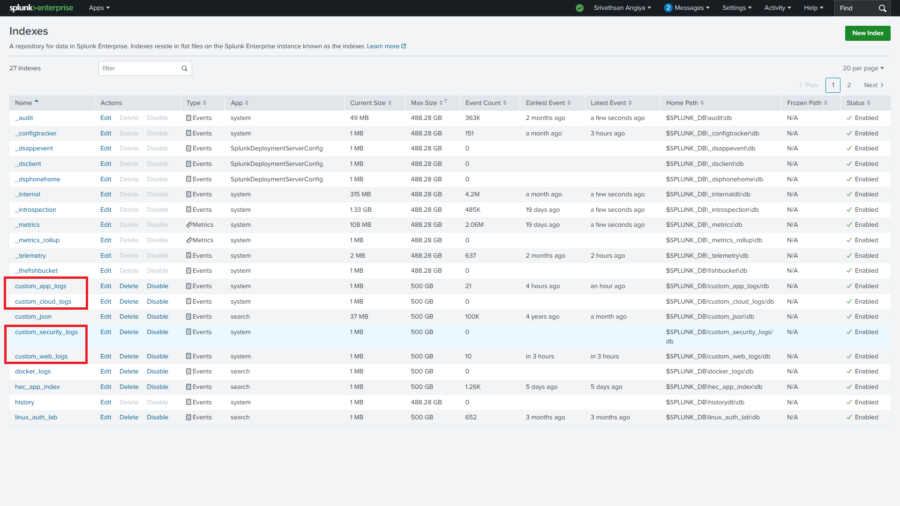
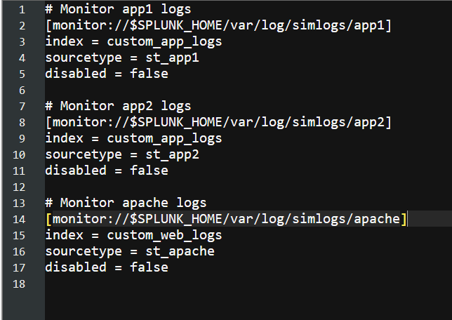
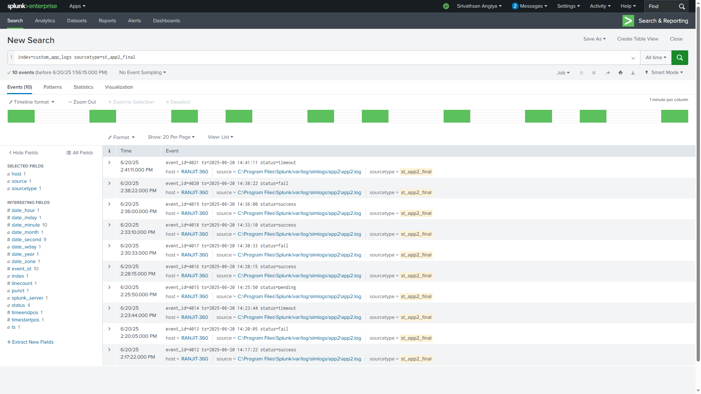

# Splunk Admin Configuration Lab

This project demonstrates a simple standalone Splunk Enterprise setup with manual configuration using `.conf` files. It includes the creation of custom indexes, input monitoring via folders, sourcetype configuration, timestamp parsing, field extraction, and log testing using synthetic data.

---

## 📁 Project Structure

```
C:\Program Files\Splunk\
│
├── etc\system\local\                     # Configuration files
│   ├── indexes.conf                        # Custom index definitions
│   ├── inputs.conf                         # Log source monitoring configuration
│   ├── props.conf                          # Timestamp parsing and field configs
│   └── transforms.conf                     # Sourcetype rewrite and field extraction rules
│
└── var\log\simlogs\                       # Folder structure for synthetic log simulation
    ├── app1\app1.log
    ├── app2\app2.log
    └── apache\apache.log
```

---

## ⚙️ Configuration Files

### `indexes.conf`

Defines four custom indexes and sets retention policies for demo purposes.

```ini
[custom_app_logs]
homePath = $SPLUNK_DB/custom_app_logs/db
coldPath = $SPLUNK_DB/custom_app_logs/colddb
thawedPath = $SPLUNK_DB/custom_app_logs/thaweddb
frozenTimePeriodInSecs = 86400
maxTotalDataSizeMB = 512000

[custom_security_logs]
...
[custom_cloud_logs]
...
[custom_web_logs]
...
```

---

### `inputs.conf`

Monitors three folders for new logs and assigns sourcetypes.

```ini
[monitor://$SPLUNK_HOME/var/log/simlogs/app1]
index = custom_app_logs
sourcetype = st_app1

[monitor://$SPLUNK_HOME/var/log/simlogs/app2]
index = custom_app_logs
sourcetype = st_app2

[monitor://$SPLUNK_HOME/var/log/simlogs/apache]
index = custom_web_logs
sourcetype = st_apache
```

---

### `props.conf`

Defines timestamp extraction and connects to transform rules.

```ini
[st_app1]
TIME_PREFIX = ^
TIME_FORMAT = %Y-%m-%d %H:%M:%S
MAX_TIMESTAMP_LOOKAHEAD = 19

[st_app2]
TIME_PREFIX = ts=
TIME_FORMAT = %Y-%m-%d %H:%M:%S
MAX_TIMESTAMP_LOOKAHEAD = 19
TRANSFORMS-force = force_app2_sourcetype
REPORT-app2fields = extract_app2_fields

[st_apache]
TIME_PREFIX = \[
TIME_FORMAT = %d/%b/%Y:%H:%M:%S %z
MAX_TIMESTAMP_LOOKAHEAD = 30
```

---

### `transforms.conf`

Handles sourcetype transformation and extracts fields from app2 logs.

```ini
[force_app2_sourcetype]
REGEX = .
FORMAT = sourcetype::st_app2_final
DEST_KEY = MetaData:Sourcetype

[extract_app2_fields]
REGEX = event_id=(\d+)\s+ts=[^\s]+\s+status=(\w+)
FORMAT = event_id::$1 status::$2
```

---

## 📄 Sample Log Data

### `app1.log`

```text
2025-06-20 12:00:00 User login successful
2025-06-20 12:15:00 Email sent to user=manager
2025-06-20 12:20:05 Disk warning: C:\ usage at 91%
```

### `app2.log`

```text
event_id=4012 ts=2025-06-20 14:17:22 status=success
event_id=4013 ts=2025-06-20 14:20:05 status=fail
```

### `apache.log`

```text
192.168.1.1 - - [20/Jun/2025:12:55:34 +0000] "GET /index.html HTTP/1.1" 200 1024
192.168.1.2 - - [20/Jun/2025:12:56:10 +0000] "POST /login HTTP/1.1" 302 512
```

---

## 📷 Screenshots

### 1. Custom Indexes in Splunk Web



### 2. Log Monitoring Paths in inputs.conf



### 3. Search Results for app2 Logs with Field Extraction



---

## 📌 Setup Steps

1. Navigate to: `C:\Program Files\Splunk\etc\system\local`
2. Create or update: `indexes.conf`, `inputs.conf`, `props.conf`, `transforms.conf`
3. Create the following folders and log files:

   * `var\log\simlogs\app1\app1.log`
   * `var\log\simlogs\app2\app2.log`
   * `var\log\simlogs\apache\apache.log`
4. Append synthetic log lines to simulate streaming behavior.
5. Restart Splunk using Administrator command prompt:

   ```cmd
   cd "C:\Program Files\Splunk\bin"
   splunk restart
   ```
6. Validate parsing and fields from Splunk Web → Search:

   ```spl
   index=custom_app_logs sourcetype=st_app1
   index=custom_app_logs sourcetype=st_app2_final
   index=custom_web_logs sourcetype=st_apache
   ```

---
